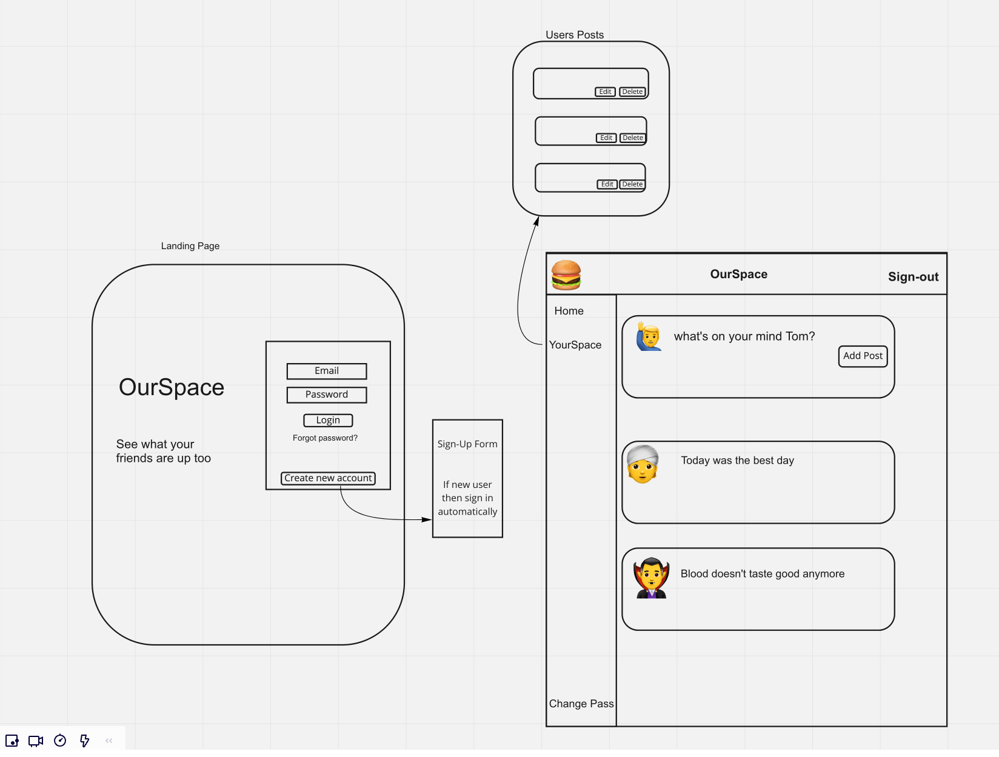

 
# Team Renderings Social Network
---
## The BackStory
- This project has allowed us to incorporate everything we have learned in this bootcamp up until now.
- We used HTML, SCSS, JavaScript and React for the front-end while using Express Mongo/Mongoose and JQuery along with AJAX for curl scirpts for the back-end.
- To me it was much more than a project - it was a big learning experience.
- Full Stack with custome API.
---
## Instructions
MVP User Stories
1. As an unregistered user, I would like to sign up with email and password.
2. As a registered user, I would like to sign in with email and password.
3. As a signed in user, I would like to change password.
4. As a signed in user, I would like to sign out.
5. As a signed in user, I would like to add a post to my wall.
6. As a signed in user, I would like to update a post on my wall.
7. As a signed in user, I would like to delete a post on my wall.
8. As a signed in user, I would like to see all my posts.
9. As a signed in user, I would like to view a list of other users and view their walls.

## WireFrame
Team Rendering 🤌🏽 Wireframe file

 1. Client must be able to sign-up successfully
 - upon. Clicking sign-up  submit button if successful user will be prompt with sign up message
 - if sign-up failed then user will be prompt with error message

 2. Client must be able to sign in successfully
 - once sign-in submit button is clicked user will be prompt with a success or error message
 - client will be directed to the Social Network page

 3. Client post page
 - client will use hamburger drop-down to sign-out and change-password
 - client must see fetch, add and delete buttons to interact with the database

4. Client will interact with the database
 - client can add a post: upon adding a post client will fill out the post form and submit
 - client submission will be saved into the database
- client will be able to update
 5. Client will be able to fetch/get all posts
- all posts will show
- client can get one post by the ID

 6. Client will be able to delete a post
 - once deleted client should not be able to see it them when fetching the posts.